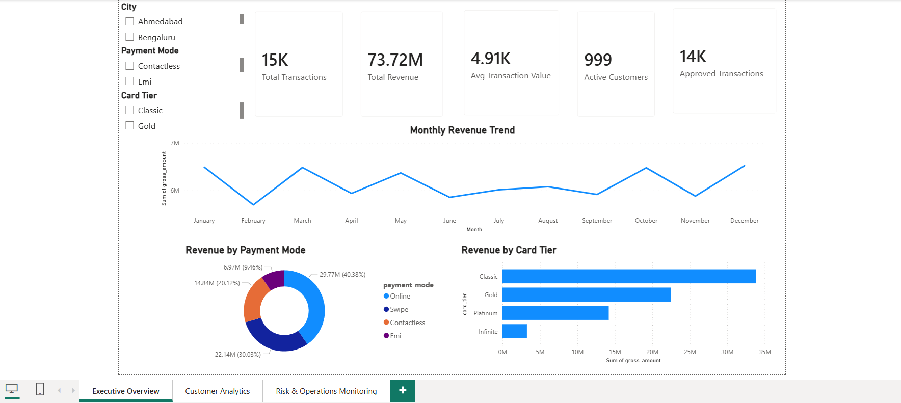
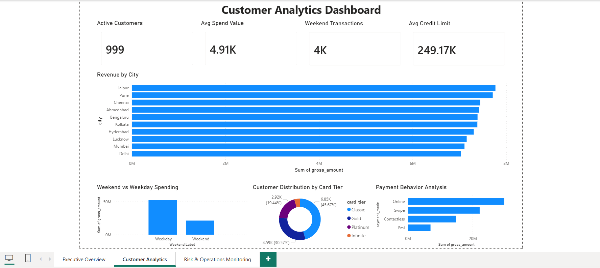
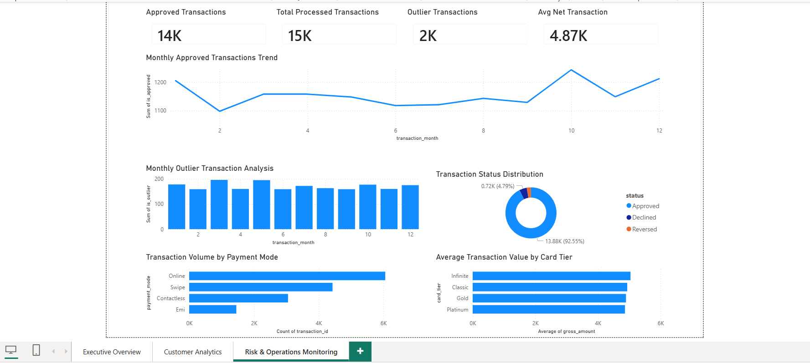

# Credit Card Transaction Analytics Dashboard

An end-to-end BFSI analytics project built using Python, SQL, and Power BI to analyze credit card transaction behavior, customer insights, operational monitoring, and revenue trends.

---

# Project Overview

This project focuses on:

- Transaction analytics
- Revenue monitoring
- Customer behavior analysis
- Risk & operational monitoring
- Payment mode analysis
- Card tier performance tracking

The solution simulates a real-world banking analytics dashboard used by business teams and operations teams for decision-making.

---

# Tech Stack

- Python (Pandas, NumPy)
- SQL
- Power BI
- CSV Data Processing
- Data Cleaning & Transformation

---

# Dashboard Pages

## 1. Executive Overview
- Total transactions
- Total revenue
- Avg transaction value
- Revenue trend analysis
- Payment mode contribution
- Card tier revenue analysis



---

## 2. Customer Analytics
- Customer segmentation
- Revenue by city
- Weekend vs weekday spending
- Customer card tier distribution
- Payment behavior analysis



---

## 3. Risk & Operations Monitoring
- Approved transactions tracking
- Outlier transaction analysis
- Transaction status distribution
- Transaction volume monitoring
- Average transaction analysis



---

# Key Insights

- Online payments generated the highest transaction volume.
- Classic card tier contributed the highest revenue share.
- Weekend transaction volume was significantly lower than weekday activity.
- Approval rates remained consistently high across months.
- Certain cities contributed disproportionately to total transaction revenue.

---

# Repository Structure

```bash
credit_card_analytics/
│
├── Dashboard/
│   └── BFSI_Transaction_Analytics_Dashboard.pbix
│
├── Screenshots/
│   ├── executive_overview.png
│   ├── customer_analytics.png
│   └── risk_operations_monitoring.png
│
├── data/
├── README.md
```

---

# Business Use Case

This dashboard can help:

- Banking operations teams
- Business analysts
- Fraud/risk monitoring teams
- Product and strategy teams

to monitor transaction health, customer behavior, and operational performance.

---

# Future Enhancements

- Real-time streaming dashboard
- Fraud detection ML model
- Customer churn prediction
- Interactive drill-through reporting
- API-based live transaction ingestion